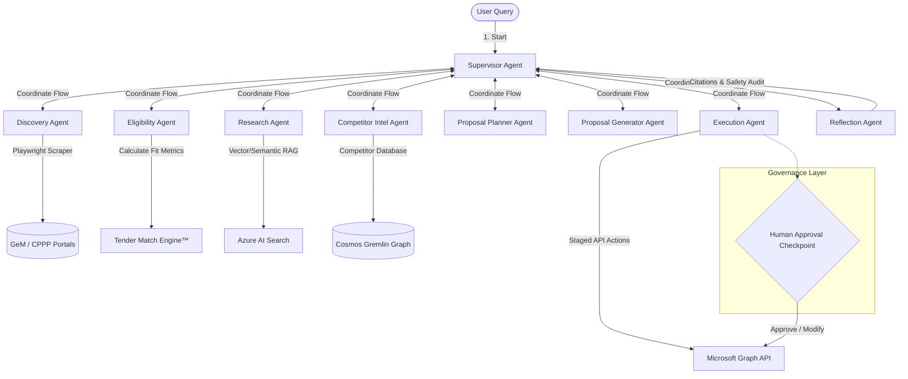

# TenderPilot AI: Autonomous Bid & Procurement AI Workforce

**Microsoft Build AI Hackathon 2026 Submission**  
**Category**: Agentic Web  
**Tagline**: *An AI Business Development Employee that finds, evaluates, and prepares government tender opportunities autonomously.*

---

## 📖 Project Description

TenderPilot AI is an **Autonomous AI Business Development Employee** designed to solve a critical business bottleneck: the highly manual, fragmented, and time-consuming process of government tender discovery and proposal preparation. 

Startups, MSMEs, and enterprises lose millions of dollars in potential revenue simply because:
1. Monitoring dozens of public procurement portals daily is logistically impossible.
2. Evaluating complex, 100-page tender specification documents for eligibility criteria is slow.
3. Draft proposals require specialized expertise and significant time to write.

TenderPilot AI automates this end-to-end process. The user enters a natural language prompt (e.g., *"Find AI and Software Development tenders under ₹50 lakh"*), and a team of **8 specialized agents** autonomously crawls portals, parses documents, checks eligibility constraints, evaluates competitor win patterns, generates compliance task roadmaps, and drafts complete bid responses. High-risk actions are held at a secure **Human-in-the-Loop Governance Checkpoint** before any emails are drafted or task checklist items are dispatched to corporate networks.

---

## 🏗️ Architecture Overview

The platform uses an event-driven, multi-agent sequence orchestrated by Microsoft's Semantic Kernel. Below is the system flow and communication topology:



---

## 🛠️ AI Tools & Microsoft Stack Integration

TenderPilot AI is built natively on the **Microsoft AI Cloud Ecosystem**:
* **Azure OpenAI (GPT-4o)**: Powering reasoning, eligibility validation, and proposal drafting across all agents.
* **Semantic Kernel**: The multi-agent orchestrator managing step planning, conversation histories, and tool-calling execution.
* **Azure AI Search (RAG)**: Indexing past bid proposals, case studies, and corporate credentials to ground model outputs in factual, historical records.
* **Azure Cosmos DB**: 
  * *NoSQL API*: Stores active workflow states, prompt traces, and session timelines.
  * *Apache Gremlin (Graph API)*: Maps the corporate knowledge graph linking tenders, requirements, rivals, and task roles.
* **Azure AI Foundry (Prompt Flow)**: Visually orchestrates and tests prompt templates, scoring LLM outputs for grounding and relevance.
* **Microsoft Graph API**: Links the workflow to Office 365 services (drafting Outlook emails and creating Planner task cards).
* **Azure Container Apps**: Hosting the FastAPI Python backend as scalable, decoupled container runtimes.

---

## 📦 Dependencies

The application relies on the following core Python libraries (specified in `backend/requirements.txt`):
* `fastapi` & `uvicorn`: High-performance backend API serving.
* `pydantic`: Strict data validation schemas for Cosmos and REST models.
* `semantic-kernel`: Microsoft's SDK for orchestrating agents and plugins.
* `playwright`: Headless browser engine for scraping public portals.
* `azure-cosmos`: Integration client for database persistence.
* `azure-search-documents`: Client for vector/keyword search indexes.
* `azure-identity`: Secure Microsoft Entra ID authentication.
* `pytest`: Test runner for automated pipelines.

---

## 🚀 Setup & Execution Instructions

The project features a **Zero-Install Local Sandbox Mode** designed specifically for judges to evaluate the platform instantly.

### 1. Run the Frontend Dashboard (Sandbox Mode - Direct Browser)
1. Open the [frontend/index.html](file:///e:/Projects/Microsoft%20Build%20AI/frontend/index.html) file directly in any modern web browser.
2. The UI will detect that the backend server is offline and automatically launch its **Local Sandbox Simulator**.
3. Click the **"Simulate Portal Crawl (CPPP)"** button in the header to watch the SVG Agent Collaboration Graph animate live!
4. Navigate to the **Human Approvals** tab to review staged outputs and submit approval decisions.
5. Query the procurement engine in the **Tender Pilot** chat assistant tab.

### 2. Run the Full Local Backend (FastAPI Server)
To start the live backend and connect the frontend to it:
1. Make sure Python 3.10+ is installed.
2. In your terminal, navigate to the project directory and install the python dependencies:
   ```bash
   pip install -r backend/requirements.txt
   ```
3. Run the FastAPI server:
   ```bash
   python backend/main.py
   ```
4. The server runs at `http://localhost:8000`. Reloading `frontend/index.html` in your browser will automatically shift it to **Live API Mode**.

### 3. Run Automated Unit Tests
To verify all agent score calculations and orchestrator transitions:
```bash
pytest backend/tests/
```

---

## 👥 Hackathon Team & Roles

* **Muskaan (AI & Machine Learning Integration)**: Responsible for setting up the backend API, integrating the Azure OpenAI (GPT-4o) model, designing prompt templates, setting up search retrieval (RAG), and writing database connection logic.
* **Shifa Monam (Frontend Web Development & Design)**: Responsible for building the dashboard interface (HTML/CSS), designing the interactive agent collaboration graph, coding the UI responses for the Tender Copilot chat, and compiling the project presentation slides.


